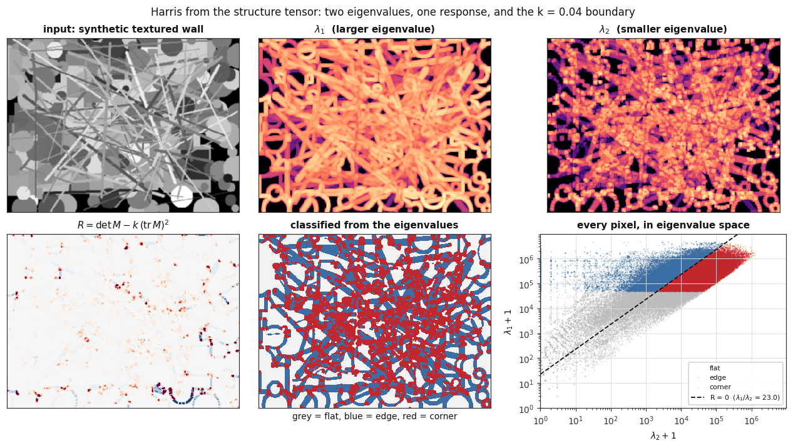
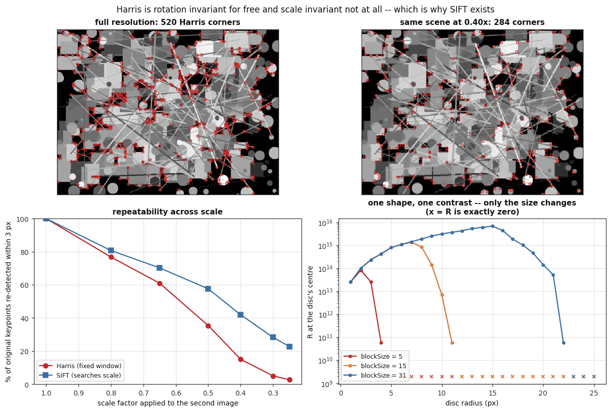
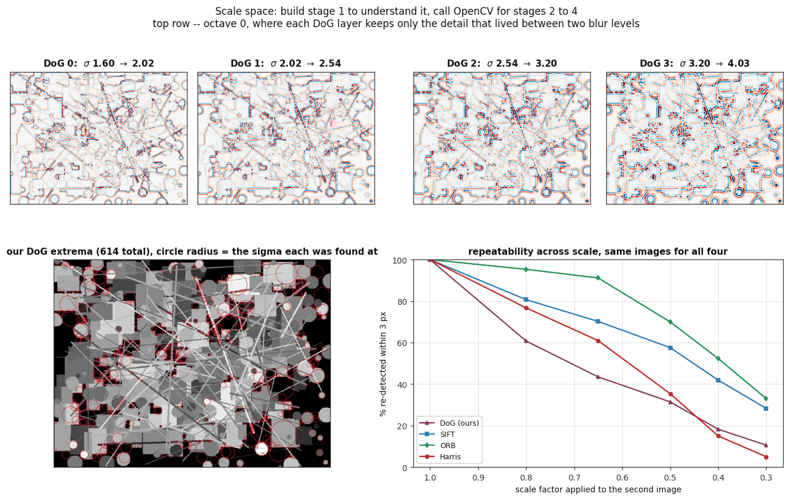
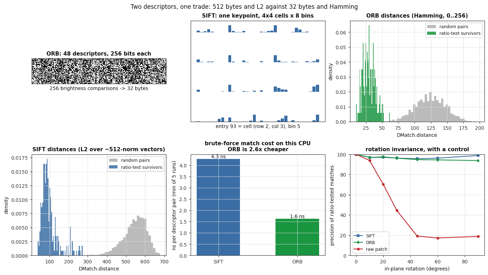
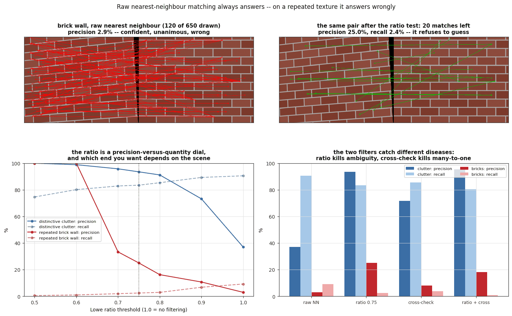
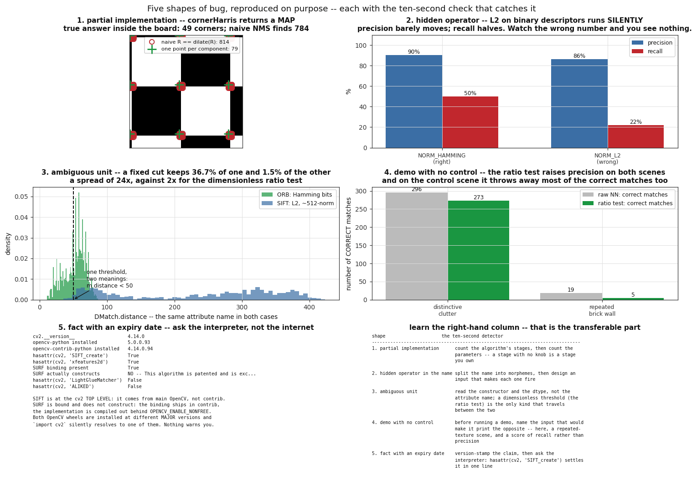
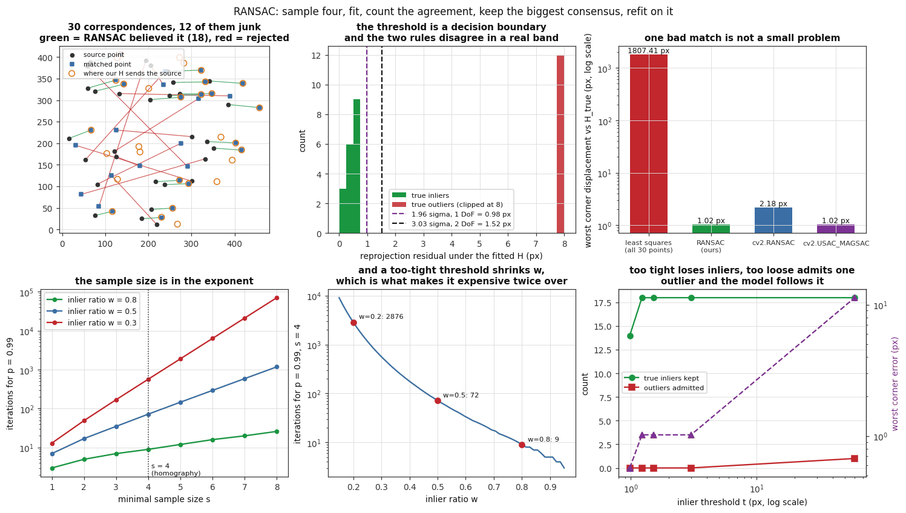
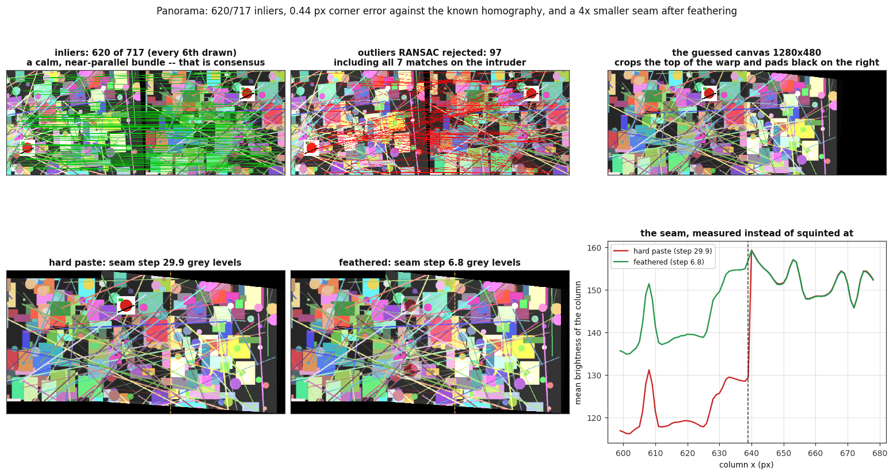

# cv02 — features to panorama

Corners, descriptors, matching, RANSAC and a stitched panorama, built from the
arithmetic up and checked numerically against OpenCV at every step.

This is a **teaching repository**. It is not the fastest way to stitch two
images — `cv2.Stitcher_create()` is four lines. It is a way to understand what
those four lines are doing, which is what you need the day they return a torn,
smeared, mirror-imaged mess and there is no error message anywhere.

Every image is synthesised in `src/feat/scenes.py`, so there are no downloads,
no dataset, and no photographs. That is deliberate: because we choose the scene
and the viewpoints, we know the exact homography relating the two views, and
"did the stitch work?" becomes a number instead of a squint at a seam.

**What you will be able to do by the end**

- Derive the Harris corner response from the structure tensor, say what each
  eigenvalue combination means, and explain why a 45° edge is *not* a corner
  even though both diagonal entries of `M` are large.
- Say why corners alone are not enough, with a measurement rather than an
  assertion, and explain what a difference-of-Gaussian pyramid buys and what it
  does not.
- Choose between SIFT and ORB on the axes that matter — bytes, distance metric,
  and the cost you measured on your own CPU.
- Explain why raw nearest-neighbour matching returns confident nonsense on a
  brick wall, what Lowe's ratio test actually measures, and why it is not a
  replacement for RANSAC.
- Recognise **five shapes of bug** from the symptom alone, and apply the
  ten-second check that exposes each one. This is the part of the repository
  that transfers to code you have never seen.
- Implement the DLT and RANSAC, derive the inlier threshold from the
  chi-squared distribution instead of copying "3 to 5 pixels" off a blog, and
  derive the iteration count instead of hard-coding 2000.

**Level:** intermediate. It assumes the previous rung,
[`cv01-pixels-to-edges`](#related-work) — convolution, gradients, Sobel, dtype
discipline, and the habit of implementing a thing before calling it.

---

## The pipeline

```
                       src/feat/scenes.py
                  synthetic scene + known H_true
                               |
        +----------------------+----------------------+
        |                                             |
   [1] DETECT                                    [2] DESCRIBE
   structure tensor M                            SIFT: 128 float32, L2
   R = det M - k (tr M)^2                        ORB:  256 bits,     Hamming
   threshold -> non-max suppress                 invariant to scale,
   feat/harris.py                                rotation, illumination
        |                                        feat/describe.py
        |  fails across scale (measured)               |
        v                                              |
   [1b] SCALE SPACE                                    |
   Gaussian ladder -> difference of Gaussians          |
   26-neighbour extrema  (SIFT stage 1, by hand)       |
   feat/scalespace.py                                  |
        +----------------------+----------------------+
                               |
                          [3] MATCH
                    brute force  (a.a - 2a.b + b.b)
                    Lowe ratio test   d1 < 0.75 * d2
                    cross-check       mutual nearest
                    feat/matching.py
                               |
                     3-37% of raw matches are correct
                               |
                          [4] FIT
                    RANSAC: sample 4, fit DLT, count
                    inliers, keep the biggest consensus,
                    refit on all of it
                    t = sqrt(5.99) * sigma   (2 DoF, not 1)
                    N = ceil(log(1-p)/log(1-w^s))
                    feat/ransac.py
                               |
                       [5] WARP + COMPOSITE
                    canvas from the transformed corners
                    hard paste (a seam) vs feathering (a blend)
                    feat/panorama.py
                               |
                          panorama.png
```

Running through it, stage by stage:

**1. Detect.** A corner is the only kind of patch pinned down in *two*
directions — flat is pinned in zero, an edge in one. That is measured by the
**structure tensor** `M`, three windowed sums of gradient products, whose two
eigenvalues say how steeply the patch changes along its two principal axes.
Harris avoids two million eigendecompositions per frame with
`R = det(M) − k·tr(M)²`, using `det = λ₁λ₂` and `tr = λ₁ + λ₂`.
`feat/harris.py` builds that from `cv2.Sobel` upward and reproduces
`cv2.cornerHarris` to a relative difference of **5.5e-8**.

**1b. Scale space.** Harris has a fixed window, so it has a fixed idea of how
big a corner is — example 02 measures repeatability collapsing from 100% to
**2.7%** as the second image shrinks to 0.25×. `feat/scalespace.py` builds a
difference-of-Gaussian pyramid and finds 26-neighbour extrema, which is SIFT's
stage 1. Stages 2 to 4 are `cv2.SIFT`, and [DECISIONS](docs/DECISIONS.md#3-build-sift-stage-1-by-hand-call-opencv-for-stages-2-to-4)
explains why that split is the right engineering call rather than a shortcut.

**2. Describe.** A detector says *where*; a descriptor says *what it looks
like*, as numbers that survive a change of scale, rotation and lighting.
Example 04 measures that survival with a control — a raw 16×16 pixel patch,
which collapses from 100% to 19% precision under rotation while SIFT and ORB
stay above 93%.

**3. Match.** Nearest-neighbour search always returns an answer and never
returns "I do not know". On a brick wall, raw nearest neighbour is **2.9%**
correct and completely confident. Lowe's ratio test asks a different question —
*is the winner clearly better than the runner-up?* — and cross-check asks a
third, *does the other image agree?* They catch different diseases.

**4. Fit.** Even after the ratio test, matches are wrong; on the panorama pair
97 of 717 survivors are geometrically impossible. Least squares cannot survive
one of them, because squaring turns a 200 px error into 40,000. RANSAC finds
the inliers by consensus first and only then fits.

**5. Warp and composite.** Estimating `H` and painting pixels are different
steps that fail differently. The corner error says whether the first worked; the
seam profile says whether the second did.

---

## Figures

All eight are produced by the numbered scripts in `examples/`, on a light
background, and every number in the captions came out of the run that made the
figure.

### 1 — The structure tensor, its eigenvalues, and the `k = 0.04` boundary



`examples/01_corner_response.py`, on a synthetic textured wall. The two
eigenvalue fields are what the Harris response is a shortcut for; the bottom-left
panel is `R` on a diverging scale so its *sign* is visible, and the bottom-right
panel puts every pixel in (λ₂, λ₁) space with the `R = 0` curve drawn. That
curve is `k·r² + (2k−1)·r + k = 0`, whose upper root at `k = 0.04` is **23.0** —
so this detector accepts eigenvalue ratios up to about 23:1, and `k ≥ 0.25`
makes `R ≤ 0` on every image forever, because the root stops being real.
The script also prints the four hand-workable 5×5 patches and the agreement
with `cv2.cornerHarris`: **relative difference 5.481e-08**, correlation
**1.0000000000**.

### 2 — Why corners are not enough



`examples/02_scale_breaks_harris.py`. Left: keypoint repeatability as the second
image is scaled down, Harris against SIFT on identical inputs. Harris falls from
100% to **2.7%** at 0.25×; SIFT falls to **22.8%** — worse than nobody expects,
better by a factor of eight. Right: one disc, one contrast, only its size
changing, with the response read at the disc's centre. The largest radius still
detected is **4 px at blockSize 5, 11 px at 15, 22 px at 31**. The cut-off
tracks the summation window and nothing else, which is why `blockSize` is not a
sensitivity knob — it is a declaration of what size of structure the detector can
see, and a detector can only make one.

### 3 — Scale space, and where to stop building



`examples/03_scale_space.py`. Top: octave 0 of the difference-of-Gaussian
pyramid — each layer keeps only the detail that lived between two blur levels.
Bottom left: the 614 extrema our stage-1 implementation finds, each drawn at the
σ it was found at. Bottom right: the honest comparison. Our bare extrema are
*worse* than Harris at a mild 0.8× (60.7% against 76.7%) because they have no
sub-pixel refinement, and twice as good at 0.3× (10.6% against 5.0%) because by
then Harris is not finding the structure at all. The gap between our column and
SIFT's is exactly what stages 2 to 4 are worth.

### 4 — Two descriptors, one trade



`examples/04_descriptors.py`. What each descriptor physically is (48 ORB
descriptors as a bitmap; one SIFT descriptor as its 4×4 grid of 8-bin
histograms), the distance distribution of true matches against random pairs for
each, the measured matching cost, and rotation invariance with a control.
Measured on this CPU (Intel i5-1135G7, 800 × 800 descriptors, minimum of five
runs, on the run that produced this figure): **SIFT 4.28 ns per descriptor pair,
ORB 1.63 ns — ORB 2.6× cheaper**, on 32 bytes against 512. Across seven repeated
runs the ratio moved between **2.0× and 3.1×**, which is what a wall-clock
measurement on a shared laptop looks like; the honest claim is "a small
single-digit factor on this CPU", not the 16× the byte counts suggest — both
matchers are memory-bound at this size and OpenCV's L2 path is well vectorised.
The control curve is a raw
16×16 pixel patch: 100% precision at 0°, **19.0% at 45°**, while SIFT holds
95.6% and ORB 94.7%.

### 5 — Raw matching lies



`examples/05_matching_lies.py`, on a synthetic running-bond brick wall. Top left:
120 of the 650 raw nearest-neighbour matches, **2.9% of them correct** and every
one returned with total confidence. Top right: the ratio test refuses to guess
and leaves 20. Bottom: the ratio threshold as a precision-versus-quantity dial on
both scenes, and the four filters compared. The number that separates "broken
matcher" from "ambiguous scene" is the *absolute* distance `d1`, which almost
nobody prints: median `d1` is **57.5 on the bricks against 259.1 on the
clutter** — the brick matches are excellent and entirely ambiguous.

### 6 — Five shapes of bug



`examples/06_five_shapes_of_bug.py`. **The heart of this repository.** Each panel
is a deliberate, reproducible instance of one shape, with the ten-second detector
that catches it. Detail below.

### 7 — RANSAC and the homography



`examples/07_ransac_homography.py`, on 30 correspondences generated from a known
`H` with 12 (40%) replaced by junk. Least squares puts the worst image corner
**1807.413 px** out of place; our RANSAC puts it **1.020 px** out — a factor of
**1772**. The threshold sweep shows both failure directions, and the two
iteration panels show why the minimal sample size dominates the cost.

### 8 — The panorama



`examples/08_panorama.py`. The whole chapter, end to end, on a pair with two
deliberate defects: an intruder object pasted at two irreconcilable positions,
and a 22% exposure difference. **620 of 717** ratio-test survivors are inliers;
the recovered homography is **0.435 px** from the known one at the worst corner
(`cv2.findHomography` gets 0.277 px on the same matches). All **7** matches on
the intruder are rejected — they are unambiguous, so the ratio test passes every
one, and only geometry can tell you they are impossible. Bottom right: the seam,
measured rather than squinted at. The hard paste steps **29.9 grey levels**; the
feathered version steps **6.8** — 4.4× smaller.

---

## The five shapes of bug

Bugs come in shapes. Naming a shape is what lets you look for it. Each of these
is reproduced on purpose in `src/feat/bugs.py`, drawn by example 06, and
asserted by `tests/test_bugs.py` — so a demonstration of a bug cannot quietly
stop demonstrating it as the library underneath moves.

| # | Shape | This chapter's instance | The ten-second detector |
|---|---|---|---|
| 1 | Partial implementation | `cv2.cornerHarris` returns a response **map**. Threshold and non-maximum suppression are yours. | Count the algorithm's stages, then count the parameters. **A stage with no knob is a stage you own.** |
| 2 | Hidden operator in the name | `BFMatcher(normType, crossCheck)` — *BF*, *norm* and *crossCheck* each change the answer, and only one of them ever says so. | Split the name into morphemes, then design an input that makes each one fire. |
| 3 | Ambiguous unit | `DMatch.distance` is a 0–256 bit count for ORB and an unbounded L2 float for SIFT. One name, two quantities. | Read the constructor and the dtype, not the attribute name. A **dimensionless** threshold is the only kind that travels. |
| 4 | Demo with no control | "The ratio test improves matching", demonstrated only on a scene where it cannot lose. | Before running a demo, **name the input that would make it print the opposite.** If you cannot, it is not evidence. |
| 5 | Fact with an expiry date | "SIFT lives in `cv2.xfeatures2d`, so you need contrib" — true until July 2020. | Version-stamp the claim, then **ask the interpreter**, not the internet. |

### What each one measures

**Shape 1 — the partial implementation.** `cornerHarris(src, blockSize, ksize,
k)` has no threshold parameter and no suppression radius, and its own
documentation says "Corners in the image can be found as the local maxima of
this response map" in a sentence that reads as description and is actually an
instruction. Compare `goodFeaturesToTrack(image, maxCorners, qualityLevel,
minDistance, …)`, which has all three knobs because it *is* the complete
pipeline. On a checkerboard with exactly **49** interior corners: 2484 pixels
pass a 1% threshold, the naive `R == dilate(R)` suppression returns **784** of
them inside the board, and one-point-per-connected-component returns exactly
**49**. *Symptom, from the bug report alone:* roughly ten times too many
keypoints, in tight clumps around each real corner, on synthetic or rendered
images — and it does not reproduce on noisy photographs, because sensor noise
breaks the exact ties. (Measured: the same naive code returns 226 instead of 814
once the board is blurred. The bug reproducing only on the *clean* test image is
what makes it look like the test is wrong.)

**Shape 2 — the hidden operator.** Three morphemes, three firing inputs.
*crossCheck* with `knnMatch(k=2)` raises `K == 1 && update == 0` — loud.
*norm* with `NORM_HAMMING` on float32 raises `batchDistance` — loud. *norm* with
`NORM_L2` on ORB's uint8 runs **silently**: raw nearest neighbour keeps 1200
matches under either metric, and the correct count falls from **323 to 244**.
After a ratio test the precision people usually print barely moves (90.5% →
86.3%) while the recall they usually do not falls by more than half (49.8% →
21.9%). *Symptom:* a pipeline that "sort of works" and gets worse on hard pairs.

**Shape 3 — the ambiguous unit.** A fixed `m.distance < 50` keeps **36.7%** of
ORB's nearest neighbours and **1.5%** of SIFT's — a spread of **24×** for one
line of code carried between two pipelines. The same threshold written as a
ratio, `d1 < 0.75·d2`, has a spread of **2×**, because dividing cancels the
unit. Two more units in the same neighbourhood: `KeyPoint.size` is a **diameter**
(use it as a radius and every patch you crop is twice the intended size), and
`KeyPoint.angle` is in **degrees**, and is −1 when unassigned.

**Shape 4 — the demo with no control.** The ratio test raises precision on the
distinctive scene from 37.0% to 93.5% while keeping 83.5% recall. That is the
demo everyone shows, and it is true. Run the control — a repeated-texture brick
wall — and it raises precision from 2.9% to 25.0% while the number of *correct*
matches falls from **19 to 5**. Both facts are the ratio test working as
designed; only the second one tells you that a higher-precision match set can be
too small to fit anything. Second control: score the shape-2 metric bug by
precision alone and it looks nearly fine; score it by recall and it has lost half
its correct matches. **A demo is only as honest as the number it chooses to
report, and precision alone can always be bought by keeping less.**

**Shape 5 — the fact with an expiry date.** SIFT's patent expired in March 2020
and SIFT moved out of contrib into main OpenCV at release 4.4.0 in July 2020.
Every tutorial written before then is still online, still confident, still
ranking well. Asked of this interpreter: `cv2.__version__` is **4.14.0**,
`hasattr(cv2, "SIFT_create")` is **True** (so it came from main OpenCV, not
contrib), `cv2.xfeatures2d.SURF_create` is *bound* and does not *construct* —
"This algorithm is patented and is excluded in this configuration" — because the
binding ships in contrib and the implementation is compiled out behind
`OPENCV_ENABLE_NONFREE`. And both OpenCV wheels are installed at once, at
**5.0.0.93** and **4.14.0.94**, two different major versions, with `import cv2`
silently resolving to one of them and nothing warning you.

---

## Why it is built this way

### Derive, then call, then prove they agree

Every module implements the thing by hand first, then shows the library version
numerically matching, then says which to use in production. The proof is the
lesson: after `harris_response(img) * s⁴` reproduces `cv2.cornerHarris` to
5.5e-8, you know the library call is your arithmetic with a scale factor on it,
and you are free to call it forever. Asserting the agreement in a test
(`tests/test_harris.py`) is what keeps the claim credible rather than
decorative.

The split is drawn deliberately, not by how hard something was:

| Built by hand | Called from OpenCV | Why |
|---|---|---|
| structure tensor, Harris `R`, threshold + NMS | `cv2.Sobel`, `cv2.boxFilter` | the response *is* the lesson; convolution was the previous rung |
| Gaussian ladder, DoG, 26-neighbour extrema (SIFT stage 1) | SIFT stages 2–4, ORB entirely | stage 1 makes "scale invariance" concrete; the rest is quality of implementation |
| brute-force L2 and Hamming k-NN, ratio test, cross-check | `cv2.BFMatcher` as the referee | nine lines of NumPy, and the `a·a − 2a·b + b·b` expansion is the whole trick |
| DLT with Hartley normalisation, RANSAC, threshold, iteration count | `cv2.findHomography` as the referee | the two numbers people guess are the two numbers this repo derives |
| canvas sizing, hard paste, feathering | `cv2.warpPerspective`, `cv2.distanceTransform` | compositing is where the seam lives, and the seam is the visible lesson |

### Numbers, not adjectives

"Faster" and "more robust" are worthless. Every claim in this README has a
measurement behind it, produced by a script you can run, and the tests assert
the ones that matter with the real figures in their failure messages. Where a
result is machine-dependent — the ORB-versus-SIFT timing — it says so and quotes
the CPU.

### Synthetic scenes, and known ground truth

Real photographs would make every failure ambiguous: when the stitch is wrong,
was it the code or the photographs? Because `two_views()` builds both images
from one planar scene through two chosen perspective transforms, `H_true` is
exact, and every claim becomes checkable — precision and recall against a known
correspondence, corner error in pixels, an inlier mask compared against the
outliers we planted ourselves. It also means the repository carries no private
study material, needs no downloads, and runs the same on any machine.

The costs are real and worth stating: synthetic texture is kinder than a
photograph in some ways (no JPEG artefacts, no lens distortion, no rolling
shutter) and crueller in others (flat regions with genuinely zero gradient, and
edges so exact they create the response plateaus that break naive suppression).
`docs/DECISIONS.md` records the trade in full.

### Precision *and* recall, everywhere

Every match filter is scored on both. Reporting precision alone is bug shape 4
in this repository's own code — precision can always be bought by keeping less,
and RANSAC downstream needs quantity: four correspondences is the bare minimum
for a homography and thirty is where it starts being stable.

---

## Honest limitations

- **Two images, one plane.** No bundle adjustment, no multi-image blending, no
  cylindrical or spherical projection. A homography is exact for a planar scene
  or a purely rotating camera and for nothing else; walk sideways through a 3-D
  scene and no single `H` fits, the inlier ratio collapses, and the overlap
  ghosts. That failure is described and diagnosed here but not fixed.
- **Feathering, not multi-band blending.** Feathering hides an exposure step
  (measured: 29.9 → 6.8 grey levels). It cannot hide a *contradiction* — where
  the two images genuinely disagree it paints half of each, so a mover appears
  twice at half strength. The production answers are a seam routed around the
  disagreement (`cv2.detail_GraphCutSeamFinder`) or a per-pixel median over three
  or more frames; both are named here and neither is implemented.
- **The DoG pyramid is SIFT stage 1 only.** No sub-pixel quadratic refinement,
  no edge or low-contrast rejection, no orientation assignment, no descriptor.
  Example 03 measures exactly what that costs, and it is not small.
- **The keypoint counts are synthetic-scene counts.** They will not transfer to
  your footage. The *shapes* of the curves transfer; the absolute numbers do not,
  and the same caution applies to the ORB-versus-SIFT timing, which is one CPU.
- **`bugs.shape2` reports a timing** to show brute force is `O(N·M)`, and the
  test does **not** assert a ratio. An earlier version asserted that doubling
  the descriptor count more than doubles the time — true in expectation, and it
  failed on a busy machine at 1.9. A wall-clock bound on shared hardware is a
  flaky test, not a stronger one, so the quadratic claim rests on the algorithm
  and on the printed number rather than on a threshold that can lose a coin
  flip in CI.
- **No FLANN.** Brute force is exact and `O(N·M)`, which is the right default
  while you are learning and debugging. FLANN is approximate — it trades a
  measurable fraction of correct nearest neighbours for speed — and it starts
  earning its keep at descriptor counts an order of magnitude above anything
  here.
- **Pinned to `opencv-contrib-python==4.14.0.94`.** OpenCV 5 renamed
  `features2d` and folded learned detectors (`ALIKED`, `DISK`,
  `LightGlueMatcher`) into the base wheel. Nothing in this repository changes as
  a result — the geometry and the estimator are identical — but the version is
  pinned so the printed numbers stay reproducible.
- **Classical, in 2026.** Production structure-from-motion and SLAM front ends
  have largely moved to learned matching (SuperPoint + SuperGlue, and the faster
  Apache-2.0 LightGlue). What they replaced is the step that *proposes*
  correspondences. RANSAC and the DLT underneath are unchanged, which is why
  this material is still the right thing to learn first.

---

## Running it

```bash
pip install -r requirements.txt

# the tests -- fast, offline, deterministic
python -m pytest -q

# the examples, in order; each writes one figure to docs/figures/
python examples/01_corner_response.py
python examples/02_scale_breaks_harris.py
python examples/03_scale_space.py
python examples/04_descriptors.py
python examples/05_matching_lies.py
python examples/06_five_shapes_of_bug.py
python examples/07_ransac_homography.py
python examples/08_panorama.py
```

Nothing downloads anything, opens a window, or needs a camera. `src/` is put on
the path by `pyproject.toml` for pytest and by `examples/_bootstrap.py` for the
scripts, so a fresh clone runs without `pip install -e .`.

## Layout

```
src/feat/
  scenes.py      synthetic images with known ground truth
  harris.py      structure tensor, corner response, map -> keypoint list
  scalespace.py  Gaussian ladder, difference of Gaussians, 26-neighbour extrema
  describe.py    SIFT and ORB, their properties, and the timing harness
  matching.py    brute force in numpy, ratio test, cross-check, scoring vs truth
  ransac.py      DLT homography, RANSAC, the threshold and the iteration count
  panorama.py    canvas from corners, warping, paste vs feather, agreement metrics
  bugs.py        the five shapes, each reproduced and measured
  figures.py     matplotlib defaults for the figures
examples/        01..08, each producing one figure
tests/           real assertions with the real numbers in their messages
docs/
  WALKTHROUGH.md the long-form explanation, stage by stage, quoting the code
  DECISIONS.md   one record per real architectural choice
  figures/       the eight committed figures
```

## Further reading

- Harris & Stephens (1988), *A Combined Corner and Edge Detector* — the response
  function and the `k` parameter.
- Lowe (2004), *Distinctive Image Features from Scale-Invariant Keypoints* —
  SIFT, and the ratio test in section 7.1.
- Rublee et al. (2011), *ORB: an efficient alternative to SIFT or SURF*.
- Fischler & Bolles (1981), *Random Sample Consensus* — the original, including
  the iteration-count argument.
- Hartley & Zisserman, *Multiple View Geometry in Computer Vision*, 2nd ed. —
  chapter 4 for the DLT and normalisation, and the χ² inlier thresholds.
- Szeliski (2006), *Image Alignment and Stitching: A Tutorial* — the
  compositing half, including multi-band blending.

## Related work

- **`cv01-pixels-to-edges`** — the previous rung. Images as arrays, dtype
  discipline, convolution by hand against `cv2.filter2D`, separable kernels,
  Sobel gradients, and Canny. The gradients this repository's structure tensor is
  built from are the ones that repository derives, and the habit of implementing
  before calling starts there.

## License

MIT. See [LICENSE](LICENSE).
